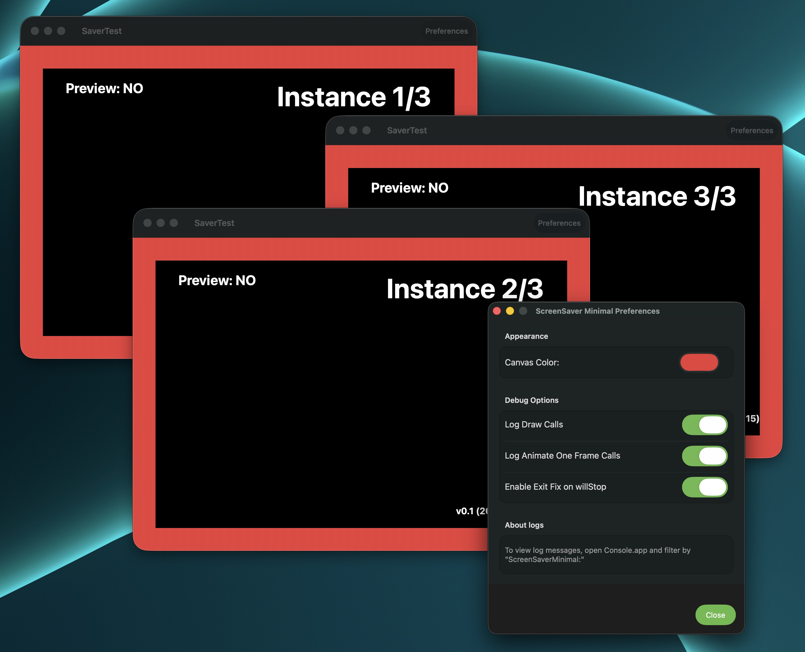

# ScreenSaverMinimal

Template to create a macOS screen saver using Swift 5 (forked from https://github.com/mirkofetter/ScreenSaverMinimal with some code taken from Aerial https://github.com/JohnCoates/Aerial).

This project can be used as a starting point to create a macOS screen saver using Swift, as, as of Xcode 26, Apple only provides a template for Objective-C screen savers. 



This template also includes workarounds when applicable for some of the known issues in macOS screensaver development, such as the `isPreview` bug and instance lifecycle management problems.

## Building and Installation

### Prerequisites
- Xcode (tested with Version 26.0 beta 4 - 17A5285i)
- macOS 15.6 or later

### Getting Started

1. **Clone the repository:**
   ```bash
   git clone https://github.com/youruser/ScreenSaverMinimal.git
   cd ScreenSaverMinimal
   ```

2. **Open the project in Xcode:**
   ```bash
   open ScreenSaverMinimal.xcodeproj
   ```

### Project Targets

This project contains two targets:

- **SaverTest**: A test application for developing and debugging your screensaver without installing it. Run this target directly in Xcode for rapid development.
- **ScreenSaverMinimal**: The actual screensaver bundle (.saver) that can be installed on your system.

### Building the Screensaver

1. Select the "ScreenSaverMinimal" scheme in Xcode
2. Build the project (⌘B)
3. The `.saver` file will be created in your build folder

### Installing the Screensaver

1. After building, use the menu Product → Show Build Folder in Finder to locate the `ScreenSaverMinimal.saver` file
2. Double-click the `.saver` file
3. macOS will prompt you to install it for the current user or all users
4. The screensaver will now appear in System Settings > Wallpaper & Screensaver

### Distribution

To distribute your screensaver to others, you must sign and notarize it:

1. **Archive the screensaver:**
   - Select Product → Archive in Xcode
   - Once the archive completes, the Organizer window will open
   - Select your archive and click "Distribute Content"
   - Choose "Export" and follow the prompts to export the .saver file

2. **Notarize via command line:**
   ```bash
   # Submit for notarization
   xcrun notarytool submit "ScreenSaverMinimal.saver" \
     --keychain-profile "AC_PASSWORD" \
     --wait
   
   # Once notarization succeeds, staple the ticket
   xcrun stapler staple "ScreenSaverMinimal.saver"
   
   # Verify the stapling
   xcrun stapler validate "ScreenSaverMinimal.saver"
   ```

   Note: You'll need to set up a keychain profile first:
   ```bash
   xcrun notarytool store-credentials "AC_PASSWORD" \
     --apple-id "your@email.com" \
     --team-id "TEAMID" \
     --password "app-specific-password"
   ```

*Note: For projects requiring broader macOS compatibility (back to macOS 11.5), there's a `legacy-support` branch that uses XIB files instead of SwiftUI for configuration. We strongly recommend against using it unless absolutely necessary.*

Please note that according to Apple, Swift screen savers are only officially supported as of macOS 14.6. There are **many** issues using Swift for screensavers on previous macOS versions (as an example, textfields won't work on High Sierra) so while you can support older versions, be aware there are *many* pitfalls that have compounded particularly since macOS Ventura and later. Unless you absolutely want to target a specific version of macOS, I highly recommend you only care about version n-1 (like this template's main branch) as it will make your life easier. Screensavers are hard enough without handling the pile of varying pitfalls that each macOS release brings.

## About Tahoe (macOS 26)

macOS 26 (Tahoe) introduced new issues with screen savers, particularly around the `isPreview` parameter behavior. Unlike previous versions where this bug could be worked around, the Tahoe bug currently has no known workaround.

Multi-monitor support is also mostly broken in new ways. 

For detailed information about known issues and potential solutions, see: [Tahoe screen saver discussion](https://github.com/JohnCoates/Aerial/issues/1396#issuecomment-3110063589)

## About Sonoma+

macOS Sonoma introduced a new wrinkle by adding screensaver videos that can become still wallpaper. This feature is exclusive to Apple at this point, but the implementation brings a lot of major issues for *legacy* screen savers, as `legacyScreenSaver.appex` and `WallpaperAgent` will cohort to do weird things. You will see this for example in Console (still here as of macOS Tahoe beta4): 

```
15:19:09.509004+0200	WallpaperAgent	A85D5DF3: BEGIN - makeWallpaper for '[screenSaver] /Users/guillaume/Library/Screen Savers/ScreenSaverMinimal.saver'
15:19:09.509489+0200	WallpaperAgent	A555DFCB: BEGIN - Initialize screen saver wallpaper for module Optional("com.glouel.ScreenSaverMinimal")
15:19:09.516292+0200	WallpaperAgent	A555DFCB: END - Initialize screen saver wallpaper for module Optional("com.glouel.ScreenSaverMinimal")
15:19:09.516324+0200	WallpaperAgent	A85D5DF3: END - makeWallpaper for '[screenSaver] /Users/guillaume/Library/Screen Savers/ScreenSaverMinimal.saver' 
```

Note that this doesn't work, you cannot set a .plugin style screensaver as a wallpaper (still or not). But this create a major bug where `legacyScreenSaver.appex` no longer sends proper stopAnimation message, nor destroys instance of the screensaver. Furthermore, it will create new ScreenSaverView every time you launch it (or open System Settings > Wallpaper > Screen Saver). This leads to many instances of ScreenSaverViews being piled up and legacyScreenSaver hogging ressources.

This repository includes a very heavy handed fix for this (exit on willstop) by forcing `legacyScreenSaver.appex` to exit. While it's a bad idea for many reason, it works, and it's the only workaround we have found. Hopefully it will get fixed in a subsequent macOS build. 

This change has two extra pitfalls : 
- Screensavers can now be set independently per screen. You can have one screensaver on a monitor, and another one in a second monitor. This generally works ok (modulo various multi monitor bugs). 
- Because of this, you can no longer set a default screensaver via command line. 

## About Catalina, Big Sur, .plugin and .appex

Starting with Catalina, the screen saver API is (in some aspects) deprecated, using the old (unsafe) plugin format. Most first party Apple screen savers are using a new App Extension format that, as of writing this, does not seem to be available yet to 3rd parties. 

Prior to Catalina, when compiling a screen saver as a `.saver`, you are compiling a plugin that will be used by either `Screen Saver Engine` or `System Preferences`, and run in their memory space. 

Starting with Catalina, your `.saver` will be a plugin to a system file called `legacyScreenSaver.appex` which itself is an extension to either `Screen Saver Engine` or `System Preferences`. 

There are two major implications to this, the first one is that your screen saver will run in a sandbox (for example, instead of `~/Library/Application Support`, this path will point to `~/Library/Containers/com.apple.ScreenSaver.Engine.legacyScreenSaver/Data/Library/Application Support`). The second one is that your interactions with the system will be limited by `legacyScreenSaver.appex` entitlements. As of macOS 11 Big Sur, those are the current entitlements : 

```
com.apple.private.xpc.launchd.per-user-lookup
com.apple.security.app-sandbox
com.apple.security.cs.disable-library-validation
com.apple.security.files.user-selected.read-only
com.apple.security.network.client
com.apple.security.network.server
com.apple.security.temporary-exception.files.absolute-path.read-only
com.apple.security.temporary-exception.mach-lookup.global-name
com.apple.CARenderServer
com.apple.CoreDisplay.master
com.apple.nsurlstorage-cache
com.apple.ViewBridgeAuxiliary
com.apple.security.temporary-exception.sbpl
(allow mach-lookup mach-register)
com.apple.security.temporary-exception.yasb
```

Couple of examples of things you can't do, override the keyboard or read files outside of the system disk. 

Also note that you must sign and notarize your screen saver in order to be able to distribute it to other users.

## SwiftUI/Combine

### Configuration Sheets
✅ **SwiftUI works perfectly for configuration sheets** - The default branch uses SwiftUI for its configuration interface.

### ScreenSaverView Content (Experimental)
This repository contains an experimental branch named `combine` that explores using SwiftUI with Combine for the main screensaver content. The implementation includes:

- **ScreenSaverViewModel**: ObservableObject with Combine publishers for reactive data updates
- **SwiftUI ContentView**: Declarative UI with animations and state binding
- **NSHostingView Integration**: Bridge between SwiftUI and ScreenSaverView framework

**Current Status**: The SwiftUI implementation works correctly in the test app target but crashes when running as an actual screen saver. 

**Important Note**: The restrictions below apply **only to the main ScreenSaverView content**, not to configuration sheets. SwiftUI is fully supported and recommended for configuration interfaces.

### Limitations for ScreenSaverView Content
At this time, it may not be possible to reliably use SwiftUI for the main screensaver content due to either:

- Sandboxing restrictions in `legacyScreenSaver.appex`
- SwiftUI runtime requirements that conflict with screen saver lifecycle
- NSHostingView incompatibilities with the screen saver drawing context

The traditional AppKit/Core Graphics approach remains the recommended implementation for the main screensaver view. 
